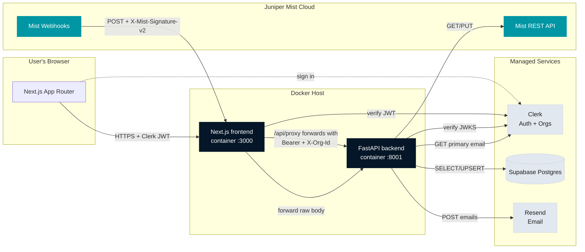
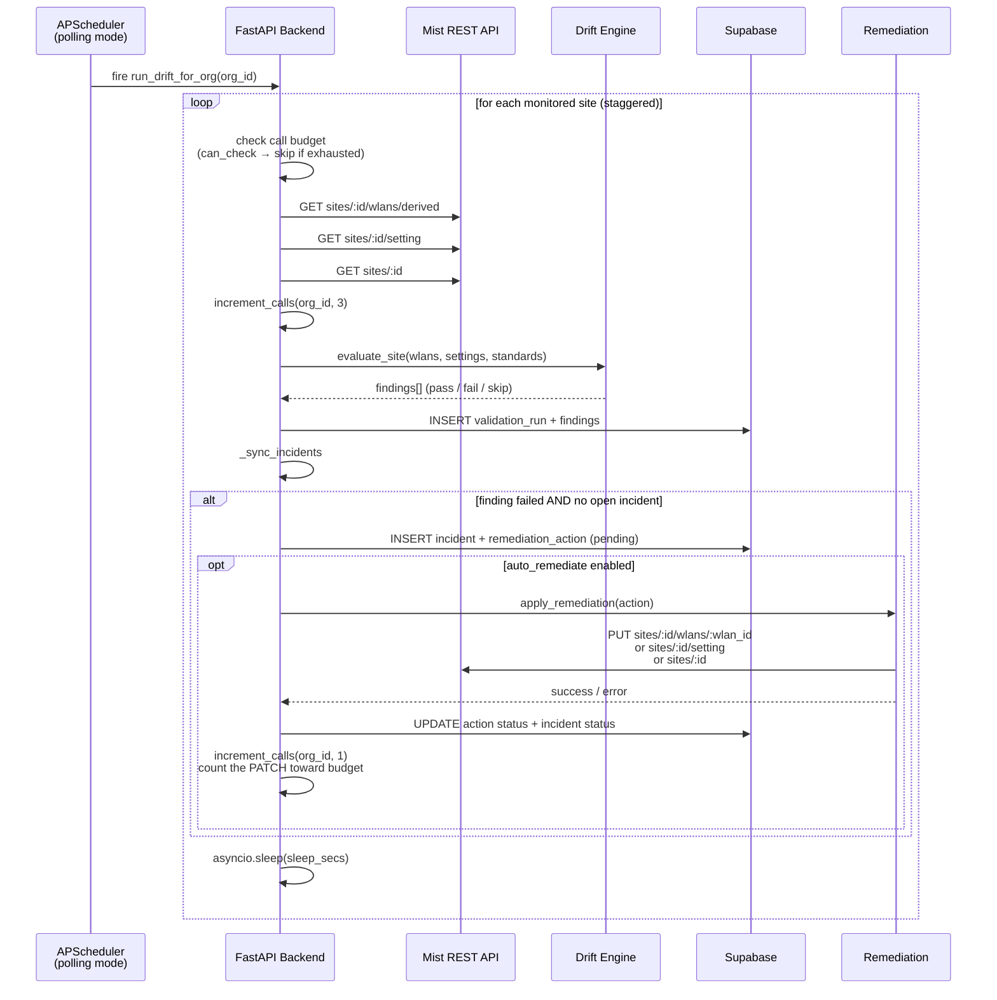
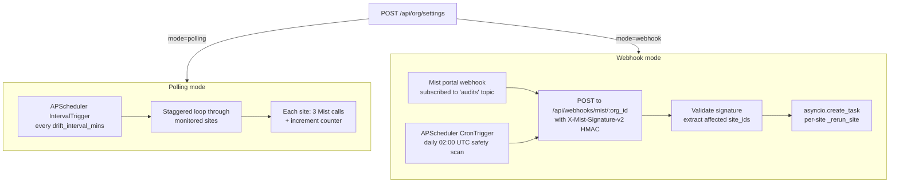

# Architecture

How the pieces connect, how data flows through the system, and the security model.

## High-level component diagram



## Components

| Component | Role |
|---|---|
| **Next.js frontend** | App Router, TypeScript, Tailwind v4. Renders the UI, calls `/api/proxy/*` which forwards to the FastAPI backend with the Clerk JWT. Also hosts the public `/api/webhooks/mist/[org_id]` route that Mist posts config change events to. |
| **FastAPI backend** | Python 3.11. Owns the drift engine, Mist API client, scheduler, remediation logic, digest sender, and live log streaming. All business logic. |
| **Supabase** | Postgres database. Stores org config, sites, standards, validation runs, findings, incidents, remediation actions, AI config, and per-org call counters. |
| **Clerk** | Authentication + Organizations. Issues signed JWTs, provides the user/org switcher UI, and exposes a Backend API the digest sender uses to look up the owner's primary email. |
| **Resend** | Transactional email (digests). Plain-text body, HTTP API. |
| **Juniper Mist** | Source of truth for WLAN + site config. The backend reads via REST, writes fixes via REST, and optionally subscribes to webhooks to flip scheduled polling off. |

## Drift check lifecycle



### Remediation verification

Remediation **does not trigger an automatic rescan**. Trusting Mist's PATCH
success response and deferring validation to the next scheduled drift cycle
avoids a 3× call amplification per remediation (and 3N× for org-scope fixes
that used to fan out across every monitored site). The `Last checked`
timestamp on every site row signals data freshness. Users can force an
immediate re-check via the per-row `Check` button when they need certainty
before the next scheduled cycle.

Webhook-triggered site reruns are a separate code path — there, Mist is
explicitly reporting "this site changed", so the 3 GET calls are the correct
action and are counted toward the hourly budget.

## Scheduler modes



**Polling** is the default. For orgs with >1,500 sites we recommend webhook mode — Mist pushes the changes and we only check the site that changed. A daily safety-net scan runs in webhook mode to catch anything the webhook delivery missed.

## Data model

The Supabase schema is applied via 7 ordered migrations in `supabase/migrations/`:

| Table | Purpose |
|---|---|
| `org_config` | Per-org settings: Mist credentials (encrypted), drift interval, mode, API call counter, webhook secret, digest config, owner_user_id |
| `site` | Mist sites synced into the app; `monitored` flag controls whether drift runs |
| `standard` | Per-org standards (name, scope, filter, check, remediation, auto_remediate, enabled) |
| `validation_run` | One row per site check; parent of findings |
| `finding` | One row per standard evaluated per WLAN/site; status + actual value |
| `incident` | Opened when a finding fails; resolved when it passes again |
| `remediation_action` | Links an incident to the Mist PATCH that fixes it; status tracks pending/approved/success/failed |
| `ai_config` | Per-org AI provider config for the Custom Config parser |

All tables have a `org_id` scope and foreign-key cascade on delete — an org delete cleans everything up.

## Security model

- **Transport.** HTTPS terminated at whatever reverse proxy / CDN fronts the app (Caddy/Vercel/etc.). Between Next.js and FastAPI, plain HTTP on the internal Docker network (`http://backend:8001`).
- **Authentication.** Clerk issues RS256 JWTs signed by their JWKS. Every backend endpoint (except the two public webhook / health routes) depends on `get_org_id` which verifies the JWT against Clerk's JWKS and extracts the org claim. The Next.js proxy also runs Clerk middleware so unauthenticated browser requests never reach the backend.
- **Mist API tokens** are encrypted at rest with a Fernet symmetric key (`TOKEN_ENCRYPTION_KEY`) before being written to `org_config.mist_token`. Decrypted only when needed for a Mist call, never returned to the frontend.
- **Webhook secrets** (for the Mist → backend webhook) are generated server-side (`secrets.token_hex(32)`), shown once in the UI, encrypted at rest, and used to HMAC-SHA256 validate every incoming Mist POST via the `X-Mist-Signature-v2` header.
- **Rate awareness.** Per-org hourly call counter. Scheduler refuses to schedule a new site check if it would push the counter above the 4,000-call check budget (leaving 1,000 headroom for remediation). Live UI shows current usage.
- **Org isolation.** Every DB query is filtered by `org_id` which comes only from the verified Clerk JWT — no cross-org data leakage possible. Each org's Mist token, sites, standards, incidents, and call counter are fully isolated.

## File layout

```
backend/
  main.py              FastAPI app, route handlers, lifespan
  engine.py            Drift evaluator — takes wlans/settings/standards → findings
  mist_client.py       Typed httpx wrapper over the Mist REST API
  remediation.py       apply_remediation() — routes PATCH to wlan/site/org
  scheduler.py         APScheduler wrapper — polling / webhook modes
  rate_limiter.py      Budget math, per-org call counter, min safe interval
  digest.py            Window math, Clerk email lookup, Resend sender
  resend_client.py     Thin httpx wrapper over Resend's API
  debug_logs.py        In-memory ring buffer + logging.Handler for live logs
  auth.py              Clerk JWT verification FastAPI dependencies
  crypto.py            Fernet encrypt/decrypt helpers
  db.py                Supabase client factory
  ai_provider.py       Anthropic/OpenAI/Ollama filter parsing

src/
  app/                 Next.js App Router pages (dashboard, sites, standards,
                       activity, settings, debug, api/proxy, api/webhooks)
  components/          React UI components, grouped by concern
  lib/                 Shared types, API client, utils, template definitions

supabase/migrations/   Ordered SQL — apply manually via Supabase SQL Editor

docs/                  Design system, setup, deployment, architecture, impact
```

## Why the pieces were chosen

| Choice | Why |
|---|---|
| **Supabase (not self-hosted Postgres)** | Zero-ops managed Postgres. Row-level security + an auth-free admin API via the service role key is simpler than running PG + PgBouncer ourselves. |
| **Clerk (not Auth0 / NextAuth)** | First-class Organizations are required for the multi-tenant model. Clerk's SDK integrates cleanly with both Next.js (UI) and FastAPI (JWKS verification). |
| **Next.js App Router (not Remix / Vite SPA)** | Server components for the Clerk proxy route, file-system routing, built-in `output: 'standalone'` for a tight Docker image. |
| **FastAPI + APScheduler** | Python is the right language for an ops tool that talks to a lot of REST APIs. APScheduler gives us cron + interval triggers in-process without needing a separate worker service. |
| **Docker Compose (not Kubernetes)** | Two containers, stateless, fronted by a reverse proxy. K8s would be massive overkill. |
| **Resend (not SMTP / Postmark)** | Modern API, generous free tier, simple domain verification. Good enough for weekly/daily transactional email. |

## Scaling model

The app is designed for Mist orgs from 5 sites to 5,000+ sites.

- **Up to ~500 sites:** polling mode, every 5-15 minutes, comfortably under the 5,000 calls/hour ceiling.
- **500–1,500 sites:** polling mode with the minimum safe interval surfaced by the UI (e.g., 45 min at 1,000 sites).
- **1,500+ sites:** webhook mode. The polling loop stops entirely; Mist pushes config change events. Steady-state Mist API usage drops to near zero — the 5,000 call/hour budget becomes almost entirely available for remediation. A single daily safety scan at 02:00 UTC catches anything missed.

The per-org call counter is decoupled per org, so a 10-org MSP deployment has 10 × 5,000 = 50,000 calls/hour of total headroom — not one shared bucket.
